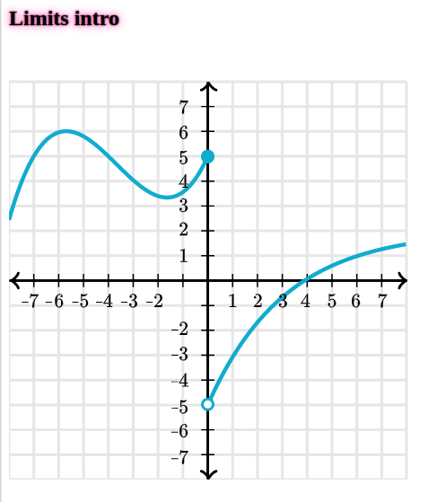

I just spent like 3 hours recreating this Khan Academy graph in Reagent Hiccup SVG. LaTeX numbers were pregenerated with MathJax's `tex2svg` package and then I just pasted the `path` strings into the code, rather than render them dynamically with KaTeX... I believe I might have had a good reason for this but there's also a good chance that I didn't.



This project has turned into a toy graphing calculator that evaluates arbitrary functions with Nextjournal's clojure-mode for Codemirror 6 and the Small Clojure Interpreter (sci).

I don't know who needs to read this (me?) but this repo is not working (besides the live demo app). I don't have the network bandwidth to push the entire repo, only to upload individual files. I've tried to push all the relevant source files but the config is wrong, on my machine I'm not even working from the same project. In other words, if you try to run this code from source it will surely fail.

### Development mode
```
npm install
npx shadow-cljs watch app
```
start a ClojureScript REPL
```
npx shadow-cljs browser-repl
```
### Building for production

```
npx shadow-cljs release app
```
